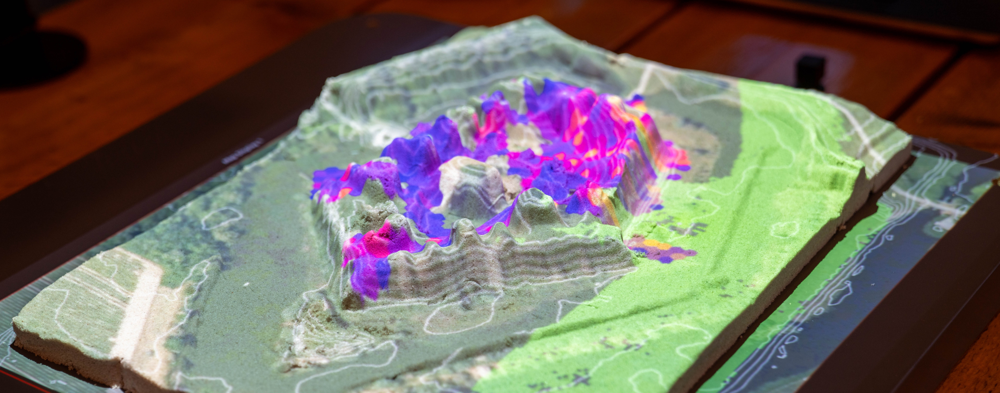
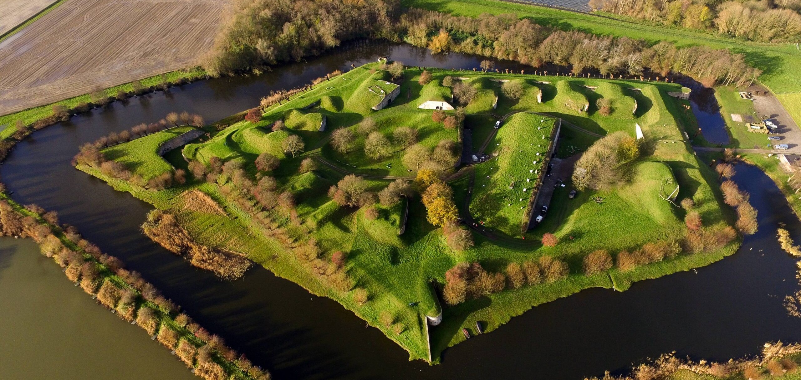
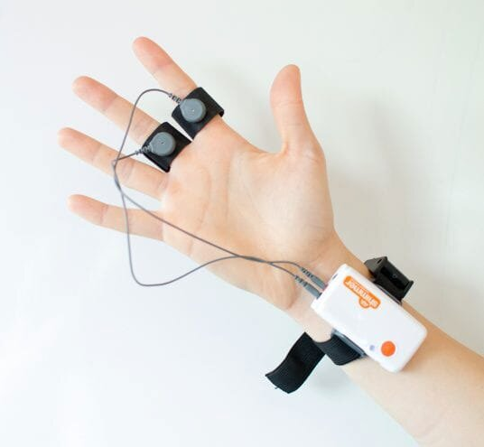

# Emotion Mapping
**Turning Human Experience into Spatial Insights**

People do not just move through places — they feel them. A walking route, a city square, or a forest trail can all evoke moments of calm, excitement, stress, or awe. Understanding these emotional patterns is key for creating spaces that are not only efficient but also meaningful and memorable.

In the Places & Flows Lab, we bring technology into the field to capture how people actually feel in real environments. With the **Shimmer GSR+**, a gold-standard device for skin conductance, we record subtle changes in sweating of the skin — one of the most sensitive indicators of emotional arousal.

---

## Shimmer GSR+

  
  
A wearable wrist device with finger sensors that records skin conductance to track emotional arousal. Combined with GPS data and our Tangible Landscape, we create <strong>emotion maps</strong> showing where people feel tense, excited, or relaxed.

---

## Example Project — Fort Sabina

At Fort Sabina, visitors wore the Shimmer device while exploring the fortress and its surroundings. By combining physiological signals with GPS and our Tangible Landscape, we created emotion maps showing where visitors felt tense, excited, or relaxed.

These insights support heritage managers in:

- Redesigning visitor flows
- Improving the overall experience of the site
- Understanding emotional responses to different spaces
