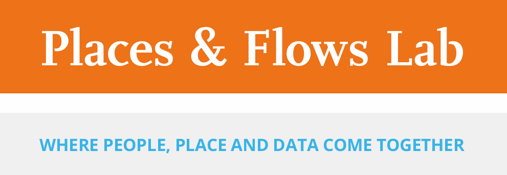

The Places & Flows Lab is a cutting-edge facility where researchers, students, and partners explore spatial challenges with innovative geospatial tools. Central to the lab is the **Tangible Landscape**, an interactive physical–digital interface that links real models of landscapes with powerful GIS software such as QGIS and GRASS GIS.

Our projects are driven by both scientific curiosity and practical needs from industry and society. Whether for tourism, mobility, spatial planning, climate adaptation, or cultural heritage, we help stakeholders see and understand complex problems in intuitive ways.

---

## Contact

  

    
<strong>Email:</strong> <a href="mailto:placesandflows@buas.nl">placesandflows@buas.nl</a>

    
<strong>Address:</strong> Mgr. Hopmansstraat 2 | Frontier Building | 4817 JS Breda | The Netherlands

      

  

