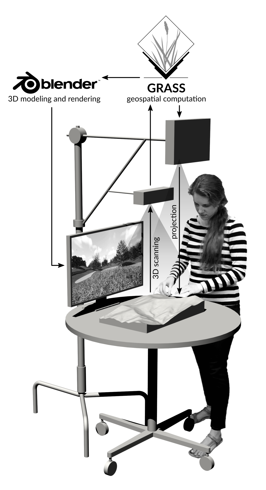
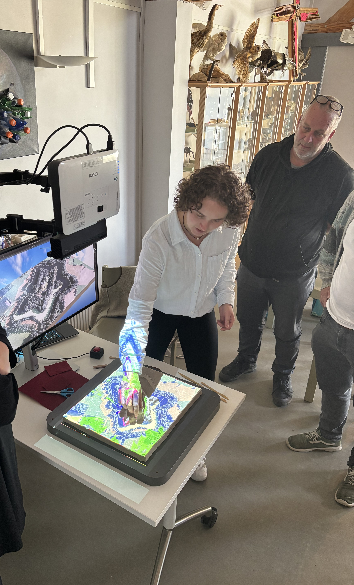

# Tangible Landscape

  
  

## Concept

With Tangible Landscape you can hold a model of a landscape in your hands, feeling the shape of the earth and sculpting its topography. When you sculpt new landforms you change the flow of simulated digital water, creating new streams and lakes. You can plant forests by simply placing pieces of colored felt and immediately see 3D renderings with the new trees.

Tangible Landscape is an **open-source** tangible interface powered by GRASS GIS and Blender. It couples a physical model with a digital model of a landscape so that you can naturally feel, reshape, and interact with the landscape. This makes geographic information systems (GIS) and 3D modeling far more intuitive and accessible for beginners, empowers geospatial experts, and creates new exciting opportunities for developers — like gaming with GIS.

---

## How It Works

A real-time feedback cycle of interaction, 3D scanning, point cloud processing, geospatial computation and projection, and 3D modeling and 3D rendering.

---

## Features

- **Collaborative** — Multiple users can interact simultaneously
- **Tangible freeform modeling** — Shape terrain by hand
- **Object detection & classification** — Place objects and get instant analysis
- **Real-time geospatial analytics** — See results instantly
- **Real-time 3D rendering** — Visualize changes in 3D
- **Time series** — Analyze change over time
- **Virtual Reality** — Immersive VR experiences
