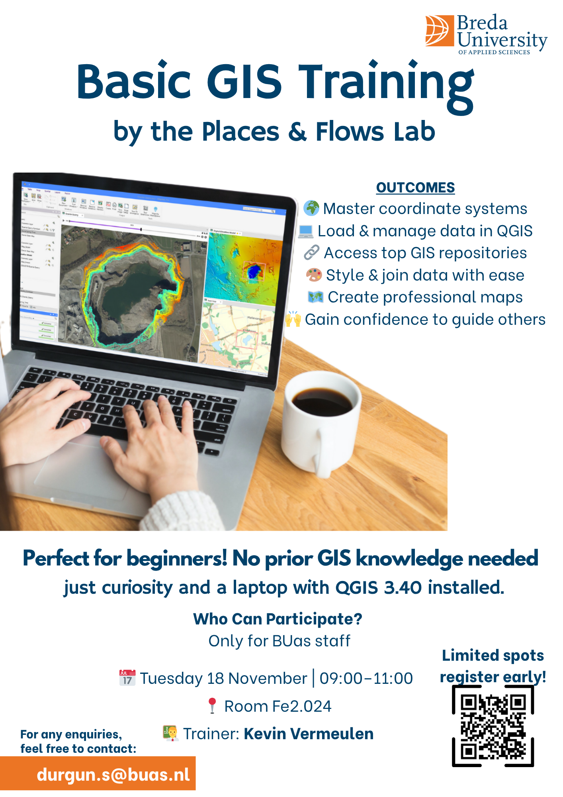

# Trainings

The Places & Flows Lab offers training materials for researchers, students, and partners who want to work with our tools and methods.

---

## Previous Training Materials

### Basic GIS Training

  

  

    
<strong>Basic QGIS Training Manual</strong>

    
Step-by-step training material for beginners covering coordinate systems, data management, spatial analysis, and map creation in QGIS.

    <a href="assets/0. Basic QGIS Training and Manual.pdf" download style="display: inline-flex; align-items: center; gap: 8px; padding: 10px 20px; background-color: #f8f9fa; border: 1px solid #e0e0e0; border-radius: 8px; text-decoration: none; color: #333; width: fit-content;">
      📥 <strong>Download PDF Manual</strong>
    </a>
  

---

## Contact

For training requests contact us at [placesandflows@buas.nl](mailto:placesandflows@buas.nl)
